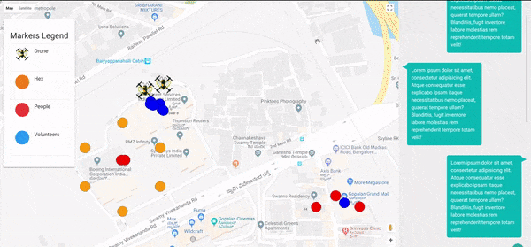

# unSting

End-to-end disaster recovery and management platform using decentralized swarm robotics (autonomous drones) using RTCs powered by agora.io to detect and track people in need of help. This information is relayed by our platform to people who are willing to help. The platform seamlessly integrates volunteers, people in need of help, and other interested parties. 

Drones collect information through a live stream that is sent to the servers in real time. Using the orientation of the drone and some assumed properties, the geolocation of the affected person is detected by mapping his location in the 2D image to a 3D coordinate using a custom-built algorithm. This data is plotted on a dashboard and sent to a PWA to assist on field search and rescue operations.

## Drones

Drones follow a hexagonal mapped path. This allows the drones to cover the maximum affected area in the minimum time. The hexagonal grid patter over the area show the path followed by the drones.

   
  <i><b>Figure:</b> Hexagonal path mapping for drones</i>

The drone carries a high definition camera and equipment to relay the video feed to the base station in real time. This feed is the processes along with some additional information from the drone.

   
  <i><b>Figure:</b> Hexacopter V1</i>

## Object detection

Uses object detection on the video feed to find people in need of help in the affected areas. This data is then combined with addition geo data and an algorithm converts this 2D image to a 3D geo location coordinate.

   
  <i><b>Figure:</b> Detecting multiple people</i>

## Data dashboard and Volunteer app

   
  <i><b>Figure:</b> Detecting multiple people</i>

#### Dashboard

The dashboard is a overview of all the moving parts of the disaster management and recovery platform. It allows for a team to view all the aspects of the situation and make decisions related to resources and on ground rescue teams.

 - [x] Drone location
 - [x] Drone path
 - [x] Volunteer location
 - [x] People location
 - [x] Over viewer - Chat interface

#### App

The Progressive Web App (PWA) allows users to sign up as volunteers and aid in the operations. They can view the location of other volunteers and people in need of help and also communicate through the chat interface.

 - [x] Volunteer location
 - [x] People location
 - [x] Volunteer Chat interface

## Contributors

 - [@nishnash54](https://github.com/nishnash54)
 - [@Souldiv](https://github.com/Souldiv)
 - [@SuryaThiru](https://github.com/SuryaThiru)
 - [@samyak-jain](https://github.com/samyak-jain)
 - [@technophilic](https://github.com/technophilic)